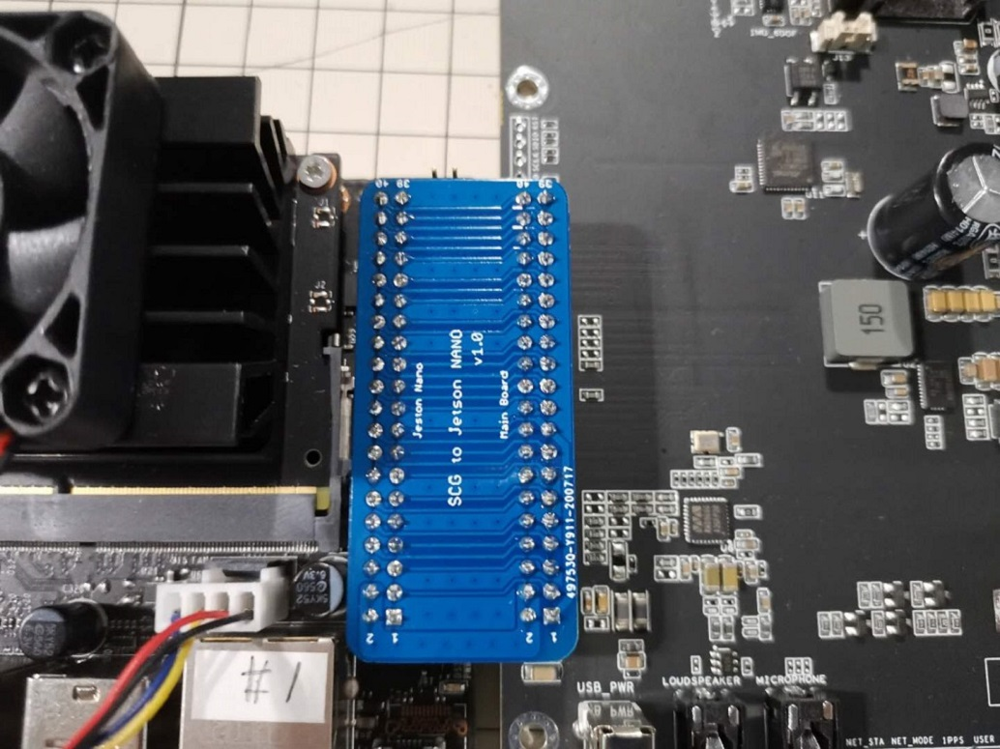

# SCG Vehicle Device Software Guide

**Seeed Technology**

## Specification for SCG Vehicle Device

|Item|Values|
|----|------|
|Peripheral Interface| 1 x USB power for Speaker<br>1 x Mic interface<br>1 x Speaker interface<br>1 x Vibration Motor interface(MAX 2A)<br>1 x SIM card slot<br>1 x SWD inerface<br>1 x IR_RING interface(MAX 3A)<br>1 x Power interface for 24_DIV and 24_TRI<br>3 x SMA Interface for LTE Antenna<br>1 x SMA Interface for GPS Antenna<br>1 x 40Pin for Jetson Nano or Raspberry Pi4|
|On-board LED|1 x 3V3 LED<br>1 x MPU_5V LED<br>1 x USER LED<br>1 x 1PPS LED<br>1 x NET_MODE LED<br>1 x NET_STA LED|
|Power|24V/2A|
|Button|1 x USER button<br>1 x Reset button<br>1 x Power Switch|
|Operating temperature(C) | 0 ~ 50|
|Humidity | < 80% |

## Hardware Overview


- **1. WM8960:** a low power stereo codec.
- **2. Power usb:** Speaker power USB.
- **3. 3.5MM JACK:** 3.5MM JACK for Speaker.
- **4. 3.5MM JACK:** 3.5MM JACK for Mic.
- **5. Led indicter:** Report the system information by LED.
- **6. Power switch:** Power on / off SCG Vehicle Device.
- **7. Reset button:** Reset SCG Vehicle Device and Jetson Nano.
- **8. Extern Interface:**  Include 1 x Vibration Motor interface , 1 x 24V power interface , 1 x USER button interface , 1 x IR_RING interface.
- **9. SIM Card slot:** insert SIM card.
- **10. EC25-E:** LTE module.
- **11. Temperature sensor:** DNP.
- **12. L70-R:** GPS module.
- **13. LSM6DS3:** 6-DOF Sensor.
- **14. Samd21:** Assist Jetson Nano to control.
- **15. SWD interface:** Update the firmware to samd21 by use this interface.
- **16. Fan:** Jetson Nano's FAN.
- **17. Grove interface:** Connect LTE to Jetson Nano.
- **18. 40PIN:** Connect SCG Vehicle Device to Jetson Nano.Pay attention to the silk screen, Not reverse the connection. `1Pin to 1Pin`

**For Jetson Nano**



**For Raspberry Pi4**


## Extern Interface Pinout


## Preparatory Work

**Materials Required**

- SCG Vehicle Device
- Jetson Nano with fan and SD card or Raspberry Pi 4 and SD card
- Internet network
- Internet cable
- PC (Recommend Windows10)
- [USB To Uart Adapter](https://www.seeedstudio.com/8USB-To-Uart-5V%26amp%3B3V3-p-1832.html) (optional)
- 24V/2A DC interface adapter 
- Speaker x 1
- Mic x1
- IR_RING x 1
- Vibration Motor x 1
- USB camera x 1
- HDMI cable x 1
- 40PIN x 1
- Card reader x 1

This software provide some shell commands and python script to demo how to drive devices on the SCG Vehicle Device. 

> Note: if you want to test the device you need to disassemble the box.

### For Jetson Nano

Most of these `commands` could input to the serial port (setting 115200,8bit,no-parity,no-flow -control) of Jetson Nano or to PUTTY window which connect to Jetson Nano through net/ssh connection.


After serial port/putty open, please login with `ubuntu:ubuntu`(User/password).

### For Raspberry Pi4

It is very necessary for us to control Raspberry Pi by using the software as belong: 
- [VNC viewer](https://www.realvnc.com/en/connect/download/viewer/)
- [IP Scanner](https://www.advanced-ip-scanner.com/)

**wifi configure:**

- Insert SD card that insert in Raspberry Pi4 to the computer by using the Card reader.
- Create wpa_supplicant.conf and ssh.

this is the content of wpa_supplicant.conf.

```bash
country=CN
ctrl_interface=DIR=/var/run/wpa_supplicant GROUP=netdev
update_config=1
network={
ssid="WIFI NAME"
psk="PASSWORD"
key_mgmt=WPA-PSK
priority=1
}
```

>Note: the WIFI has to be same with a local net of your computer.
And ssh file is an empty file.

- Put wpa_supplicant.conf and ssh file to boot folder.


- Insert SD card to Raspberry Pi and power on

- Scan Raspberry Pi's IP by using IP Scanner


> Note:The scanning range depends on your local area network

- Access terminal of Raspberry by using putty


username:`pi`,password:`raspberry`.

**VNC service:**

- Typing command then open configure menu.

```bash
sudo raspi-config
```

- Select `5 Interfacing Options` then Select `P3 VNC`.


- Select `7 advanced Options` then Select `A5 Resolution` final Choose `DMT Mode 16`.


- Select `Finish` and `Reboot`.


- Open `VNC viewer` and typing IP to access the desktop of Raspberry.

username:`pi`,password:`raspberry`.

## Devices Usage

### USB Camera

Connect the USB Camera to any USB port of Jetson Nano or Raspberry Pi4.

```bash
# Install cheese application, apt require Internet connection.
sudo apt update
sudo apt install cheese
```

**For Jetson Nano**

>Note cheese command require GUI output, so it should enter into terminal window of Ubuntu Desktop, not the serial port or putty window. To input this command, you should use a `USB keyboard & HDMI display`.

```bash
cheese
#Then the video captured by camera will view on HDMI display.
```

**For Raspberry Pi4**

>Note cheese command require GUI output, so it should enter into terminal window of Raspberry Desktop, not the putty window. To input this command, you should use a `VNC viewer`.

```bash
cheese
#Then the video captured by camera will view on VNC viewer.
```

### Speaker & Micphone(WM8960)

**For Jetson Nano**

```bash
arecord -D hw:1,0 -f S32_LE -r 48000 -c 2 | aplay -D hw:1,0 -f S32_LE \ 
-r  48000 -c 2
# The captured sound from jack MICPHONE will playback on jack LOADSPEAKER the same time.
```

If you insert a USB camera before Jetson Nano boot. you must modify the HW option as follows.

```bash
arecord -D hw:2,0 -f S32_LE -r 48000 -c 2 | aplay -D hw:2,0 -f S32_LE \
-r 48000 -c 2
```

the codec detail as follow:
|sample rate|channels|Sample formats|
|:----:|:-----:|:-----:|
|8k<br>11.025k<br>22.05k<br>32k<br>44.1k<br>48k|2|S16_LE<br>S24_LE<br>S32_LE|


>Please try a few more times if it report sound card busy.

**For Raspberry Pi4**

```bash
arecord -D hw:2,0 -f S32_LE -r 48000 -c 2 | aplay -D hw:2,0 -f S32_LE \ 
-r  48000 -c 2
# The captured sound from jack MICPHONE will playback on jack LOADSPEAKER the same time.
```

If you insert a USB camera before Raspberry Pi boot. you must modify the HW option as follows.

```bash
arecord -D hw:3,0 -f S32_LE -r 48000 -c 2 | aplay -D hw:3,0 -f S32_LE \
-r 48000 -c 2
```

the codec detail as follow:
|sample rate|channels|Sample formats|
|:----:|:-----:|:-----:|
|8k<br>11.025k<br>22.05k<br>32k<br>44.1k<br>48k|2|S16_LE<br>S24_LE<br>S32_LE|


>Please try a few more times if it report sound card busy.


### Vibration Motor

Download script from:

https://github.com/turmary/vehicle-examples/blob/master/motor_control.py

>We will always transfer any updates/bugfix to the github repository if required.
```bash
python3 motor_control.py
#Motor on for 2 seconds, then off for 2 seconds, repeatedly.
```

### Button

Download script from:

https://github.com/turmary/vehicle-examples/blob/master/button.py

```bash
python3 button.py
#Wait for user press the BUTTON, echo “pressed” after the press, then exit.
```

### 6-DOF Sensor (LSM6DS3)

```bash
export PYTHONPATH=$HOME/git/LSM6DS3/src
cd $HOME/git/LSM6DS3; python3 examples/example_poll.py
#Display gyroscope & Accelerometer data got by the sensor every 0.3 second.
```

the Sensor the min scale is ±2 g.

### GPS(L70-R)

Download script from:

https://github.com/turmary/vehicle-examples/blob/master/nema2_reader.py

**For Raspberry Pi4**

```bash
#sudo pip3 install pynmea2 pyserial
sudo python3 nema2_reader.py /dev/ttyAMA0
#Display NEMA data got from the GPS module.
```

**For Jetson Nano**

```bash
#sudo pip3 install pynmea2 pyserial
sudo python3 nema2_reader.py /dev/ttyTHS1
#Display NEMA data got from the GPS module.
```

### LTE(EC25-E)

>Note insert the SIM card when power off state.

```bash
cd ~/git/linux-ppp-scripts
```

Below setting should consult you SIM-Card/Cell-Network provider.

```bash

# Config User/Password in file quectel
cat quectel
# Config APN in file quectel-chat-connect
cat quectel-chat-connect
# Update the change to system
sudo ./install
```

Download script from:

https://github.com/turmary/vehicle-examples/blob/master/quectel-onoff.py

```bash
# sudo apt install ppp
# Power on the LTE module
sudo python3 quectel-onoff.py
#The script will need some time to power on or power off.
#The USER LED will light when the LTE power successfully.
```

Internet test

```bash
# Dial the Cell Network, run in background
pppd call quectel &
# if failed, please try with sudo prefix
# sudo pppd call quectel &
# Test the network
ping -I ppp0 www.china.com
#Should receive response bytes from the site.
```

### IR_RING

Download script from:

https://github.com/turmary/vehicle-examples/blob/master/IR_Control.py

```bash
#sudo Pip3 install smbus
#If you want to power on the IR_RING you can use cmd as follow
sudo python3 IR_Control.py on
#The IR_RING will bright in a dark environment.
#If you want to power off the IR_RING you can use cmd as follow
sudo python3 IR_Control.py off
```

### Fan (Only exist in Jetson Nano)

Download script from:

https://github.com/turmary/vehicle-examples/blob/master/Fan_Control.py

```bash
#If you want to power on the Fan you can use cmd as follow
sudo python3 Fan_Control.py on
#If you want to power off the Fan you can use cmd as follow
sudo python3 Fan_Control.py off
```

>Since the inertia, the Fan will need some time to stop.
